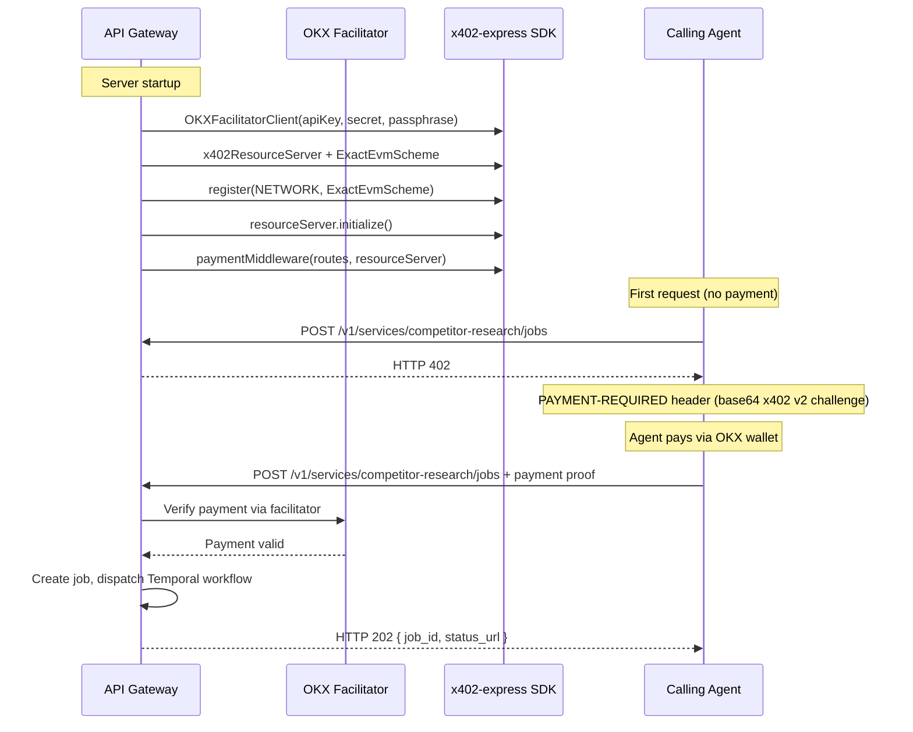
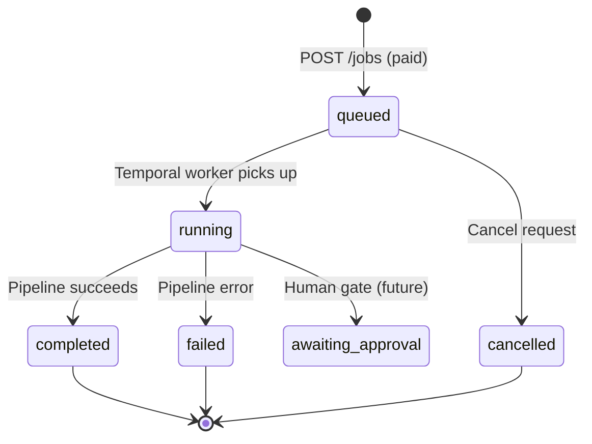
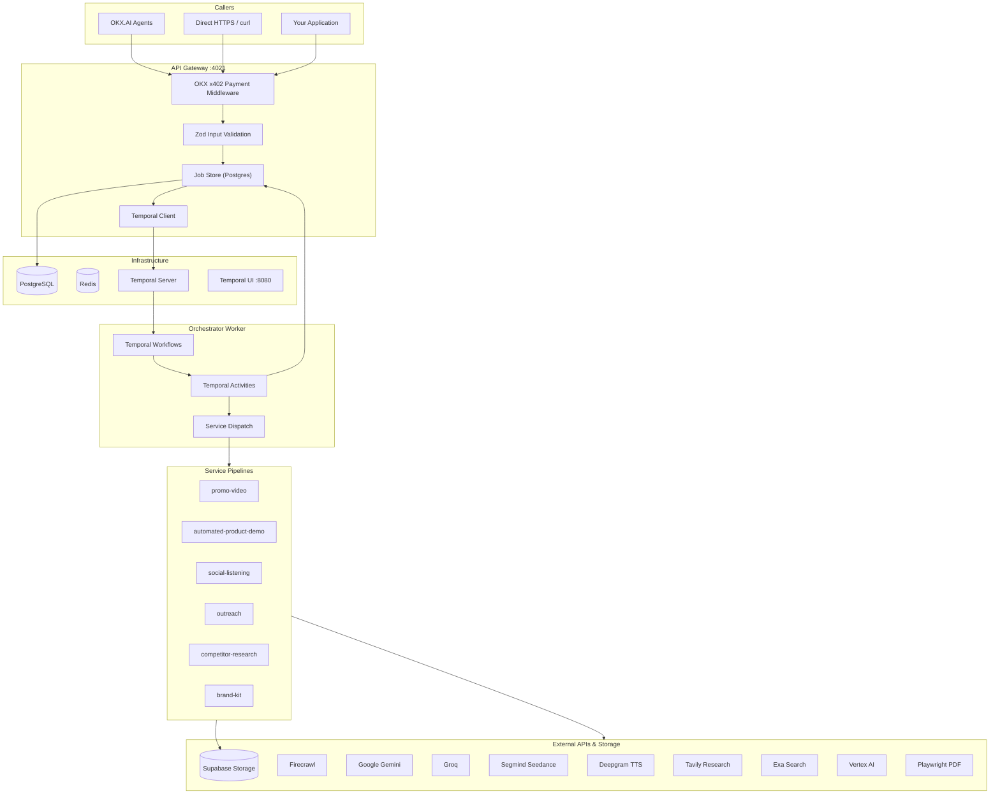
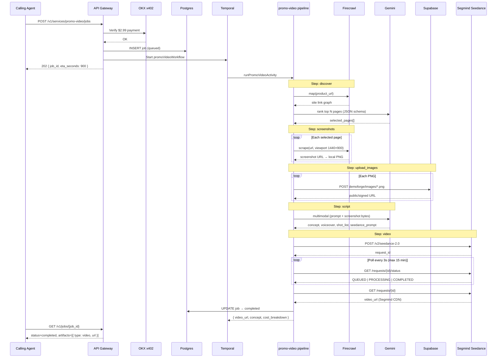
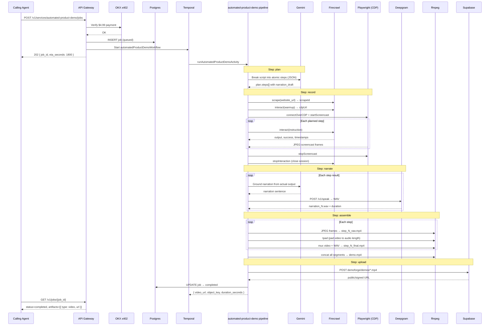

```mermaid
flowchart LR
    subgraph Input["A2MCP Input"]
        URL["product_url"]
        DUR["duration (4–15s)"]
        RES["resolution (480p–4k)"]
        MP["max_pages (1–9)"]
    end

    subgraph Phase1["Phase 1 — Discover"]
        FCMap["Firecrawl Map"]
        Heuristic["URL Heuristic Filter"]
        GeminiRank["Gemini Page Ranker"]
    end

    subgraph Phase2["Phase 2 — Capture"]
        FCScrape["Firecrawl Viewport Scrape"]
        PNG["1440×900 PNG Screenshots"]
    end

    subgraph Phase3["Phase 3 — Upload"]
        SupaUp["Supabase Upload"]
        PubURLs["Public Image URLs"]
    end

    subgraph Phase4["Phase 4 — Script"]
        MultiGem["Multimodal Gemini"]
        Script["Ad Script + Shot List"]
        SDPrompt["Seedance Prompt"]
    end

    subgraph Phase5["Phase 5 — Video"]
        SDSubmit["Segmind Seedance 2.0 Submit"]
        SDPoll["Async Poll (≤15 min)"]
        MP4["MP4 Artifact URL"]
    end

    URL --> FCMap
    DUR --> SDSubmit
    RES --> SDSubmit
    MP --> GeminiRank

    FCMap --> Heuristic --> GeminiRank
    GeminiRank --> FCScrape --> PNG
    PNG --> SupaUp --> PubURLs
    PubURLs --> MultiGem
    PNG --> MultiGem
    MultiGem --> Script --> SDPrompt
    SDPrompt --> SDSubmit
    PubURLs --> SDSubmit
    SDSubmit --> SDPoll --> MP4
```

```mermaid
flowchart LR
    subgraph Input["A2MCP Input"]
        URL["website_url"]
        SCRIPT["script (NL demo instructions)"]
    end

    subgraph Phase1["Phase 1 — Plan"]
        GeminiPlan["Gemini Step Planner"]
        Steps["Atomic Browser Steps"]
    end

    subgraph Phase2["Phase 2 — Record"]
        FCScrape["Firecrawl Scrape"]
        FCInteract["Firecrawl /interact"]
        CDP["Playwright CDP Screencast"]
        Frames["JPEG Frame Buffer"]
    end

    subgraph Phase3["Phase 3 — Narrate"]
        GeminiNarr["Gemini Grounded Narration"]
        DG["Deepgram Aura TTS"]
        WAV["Per-Step WAV Clips"]
    end

    subgraph Phase4["Phase 4 — Assemble"]
        FFBuild["ffmpeg Segment Build"]
        FFPad["Frame Padding (tpad)"]
        FFMux["Audio/Video Mux (AAC)"]
        FFConcat["Segment Concat"]
    end

    subgraph Phase5["Phase 5 — Upload"]
        SupaUp["Supabase Upload"]
        MP4["Narrated MP4 URL"]
    end

    URL --> FCScrape
    SCRIPT --> GeminiPlan --> Steps
    FCScrape --> FCInteract
    Steps --> FCInteract
    FCInteract --> CDP --> Frames
    Steps --> GeminiNarr
    Frames --> FFBuild
    GeminiNarr --> DG --> WAV
    WAV --> FFMux
    FFBuild --> FFPad --> FFMux --> FFConcat --> SupaUp --> MP4
```

# FounderForge

> **The entire marketing department — distilled into six API calls.**

FounderForge is an **Agent Service Provider (ASP)** on [OKX.AI](https://www.okx.ai) that gives solo founders the power of a full go-to-market team. Drop in a URL, a brief, or a spreadsheet. Get back promo videos, product demos, competitor reports, investor outreach packs, Reddit engagement playbooks, and production-ready brand kits — all orchestrated by AI agents, settled instantly on-chain, and delivered as downloadable artifacts.

This is not a chatbot. This is not a template library. **This is automated marketing infrastructure for the one-person billion-dollar company era.**

---

## Table of Contents

1. [Important Links](#important-links)
2. [The Problem](#the-problem)
3. [The Solution — FounderForge](#the-solution--founderforge)
4. [OKX — The Payment & Discovery Layer](#okx--the-payment--discovery-layer)
5. [A2MCP — How Agents Call FounderForge](#a2mcp--how-agents-call-founderforge)
6. [Platform Architecture](#platform-architecture)
7. [Service 1 — Promo Video](#service-1--promo-video)
8. [Service 2 — Automated Product Demo](#service-2--automated-product-demo)
9. [Service 3 — Social Listening](#service-3--social-listening)
10. [Service 4 — Outreach](#service-4--outreach)
11. [Service 5 — Competitor Research](#service-5--competitor-research)
12. [Service 6 — Brand Kit](#service-6--brand-kit)
13. [Universal API Reference](#universal-api-reference)
14. [Getting Started (Developers)](#getting-started-developers)
15. [Conclusion — The Next Big Thing](#conclusion--the-next-big-thing)

---

## Important Links

| Resource | Link |
|----------|------|
| **Demo Video** | |
| **ASL** | |

---

## The Problem

Picture this.

It is 11:47 PM on a Tuesday. You are the founder. You are also the CEO, the product manager, the engineer, the customer support rep, and — whether you signed up for it or not — **the entire marketing department**.

You just shipped something you are genuinely proud of. The product works. Early users love it. You know, in your bones, that this could be big. But the world does not know you exist yet.

So you open seventeen tabs.

One tab is Canva, where you are squinting at a logo that looks like it was made in 2011. Another is a competitor's landing page — slick, confident, with a demo video that makes *their* mediocre product look revolutionary. A third tab is a spreadsheet of investors you found on Crunchbase at 2 AM last week, half of them wrong, none of them with verified contact info. A fourth is Reddit, where someone in r/SaaS is literally asking for exactly what you built — and you have no idea how to reply without sounding like a spam bot.

You need a promo video. You need a product demo. You need to know who your competitors are and how you stack up. You need a brand identity that does not embarrass you on Product Hunt. You need investor outreach materials that do not read like they were generated by a tired intern. You need to find the conversations happening *right now* where your product is the answer.

A funded startup throws $15,000 a month at an agency and gets all of this. You have $47 in your business account and whatever is left of your sanity.

---

### The One-Person Billion-Dollar Company Is Not a Fantasy Anymore

We are living through a structural shift in how companies get built.

AI collapsed the cost of writing code. No-code tools collapsed the cost of design. Cloud infrastructure collapsed the cost of scale. The result is a new archetype: **the solo founder who builds, ships, and scales a product that would have required a 20-person team five years ago.**

Pieter Levels runs multiple seven-figure products alone. Indie hackers routinely hit $10K MRR with zero employees. The phrase "solopreneur" stopped being a lifestyle blog keyword and started being a legitimate business model — one that VCs are now actively funding.

But here is the cruel asymmetry: **building got cheap. Marketing did not.**

The grunt work of go-to-market — the research, the creative, the outreach, the positioning, the community engagement — still eats weeks of a solo founder's calendar. Every hour spent making a demo video is an hour not spent talking to users. Every hour spent manually scraping competitor pricing pages is an hour not spent fixing the bug that is causing churn.

Solo founders are winning on product. They are losing on **distribution**.

They do not need another SaaS dashboard. They do not need another "AI writing assistant" that outputs generic LinkedIn posts. They need **the operational output of an entire marketing team** — research reports, videos, brand assets, outreach packs — delivered on demand, without hiring, without retainers, without the 6-week agency timeline.

That gap is exactly what FounderForge exists to close.

---

## The Solution — FounderForge

**FounderForge is the first full-stack marketing suite built exclusively for solo founders — exposed as six standardized, pay-per-call agent services on OKX.AI.**

From your product URL to a polished promo video. From a natural-language script to a narrated screen recording of your live app. From a brand name and a two-sentence brief to a downloadable ZIP of logos, fonts, colors, and social banners. From your website and revenue spreadsheet to an investor intelligence report with verified contacts. From your product category to a five-competitor analysis with SWOT, pricing matrices, and positioning maps. From your landing page to a curated list of Reddit threads with draft responses ready to post.

**A to Z. One platform. Six services. Zero headcount.**

---

### What FounderForge Does (High Level)

| Service | What You Get | Price |
|---------|--------------|-------|
| **Promo Video** | AI-generated promotional video from your product URL | $2.99 |
| **Automated Product Demo** | Narrated screen recording following your script | $4.99 |
| **Social Listening** | Reddit thread discovery + draft engagement comments (PDF) | $1.99 |
| **Outreach** | Investor intelligence report from website + revenue data | $2.49 |
| **Competitor Research** | Full competitor analysis report (PDF) | $4.99 |
| **Brand Kit** | Complete brand identity ZIP (logos, fonts, colors, assets) | $3.99 |

Every service follows the same contract:

1. **You send structured input** — a URL, a brief, a spreadsheet link.
2. **You pay once** — fixed price, settled instantly via OKX x402 on X Layer.
3. **FounderForge runs a multi-agent pipeline** — scraping, LLM reasoning, media generation, PDF compilation.
4. **You poll for results** — free, unlimited polling until your artifacts are ready.
5. **You download deliverables** — MP4, PDF, or ZIP, hosted on Supabase Storage or CDN.

No subscriptions. No credits that expire. No "contact sales." **One call, one price, one deliverable.**

---

### Why Solo Founders Win With FounderForge

**Speed.** What takes a marketing team two weeks takes FounderForge fifteen to thirty minutes. Ship your Product Hunt launch with a demo video the same day you finish the feature.

**Cost.** Six services, combined, cost less than one hour of a freelance designer's time. The entire suite — promo video, brand kit, competitor report, demo, outreach pack, and social listening — costs under **$20**.

**Quality.** These are not template fills. Each pipeline chains specialized AI agents with best-in-class external tools — Firecrawl for browser automation, Gemini and Groq for reasoning, Segmind Seedance for video generation, Deepgram for narration, Exa for investor search, Tavily for social discovery, Vertex AI for brand image generation.

**Agent-native.** FounderForge is built as an **A2MCP** service on OKX.AI. That means AI agents — not just humans — can discover, pay for, and consume FounderForge services autonomously. Your marketing stack becomes callable by any agent on the OKX marketplace.

**Async by design.** Long-running pipelines do not block your HTTP connection. Create a job, get a `job_id`, poll until complete. Pattern A (paid create → free poll) is baked into the architecture from day one.

---

## OKX — The Payment & Discovery Layer

OKX is not a footnote in FounderForge. **OKX is the economic and discovery substrate that makes the entire platform possible.**

Without OKX, FounderForge would need to build custom payment rails, manage subscription billing, handle chargebacks, integrate Stripe, worry about international tax compliance, and manually onboard every customer. Without OKX.AI marketplace listing, FounderForge would be invisible to the fastest-growing customer segment in tech: **autonomous AI agents that need to buy services on behalf of their users.**

Here is exactly how OKX integrates — technically, operationally, and strategically.

---

### OKX.AI — Agent Service Provider (ASP) Model

FounderForge registers on [OKX.AI](https://www.okx.ai) as an **ASP (Agent Service Provider)** — a seller of standardized agent-callable services. Each of our six products is listed as an independent **A2MCP (Agent-to-MCP)** endpoint with:

- A fixed HTTPS URL (`POST /v1/services/{service}/jobs`)
- A fixed price per call (e.g., `$4.99` for competitor research)
- An x402-compliant payment challenge on unpaid requests
- Instant settlement on **X Layer** in **USD₮0**

Agents discover FounderForge by **Agent ID** on the OKX marketplace. They read the service catalog via `GET /v1/services`. They pay and invoke — no human in the loop required.

This is fundamentally different from traditional SaaS:

| Traditional SaaS | FounderForge on OKX |
|------------------|---------------------|
| Monthly subscription | Pay-per-call |
| Human signup flow | Agent wallet payment |
| Stripe / credit card | x402 on-chain settlement |
| Dashboard UI | REST API + artifact URLs |
| Vendor lock-in | Open protocol, any agent can call |

---

### x402 Payment Protocol — Technical Deep Dive

FounderForge implements the **x402 protocol** via the official OKX Payment SDK. Here is the complete technical flow.

#### Packages Used

```bash
npm install @okxweb3/x402-express @okxweb3/x402-core @okxweb3/x402-evm
```

These packages live in `@founderforge/payments-okx` and are wired into the API gateway at startup.

#### Environment Configuration

```bash
# Production
OKX_API_KEY=your_api_key
OKX_SECRET_KEY=your_secret_key
OKX_PASSPHRASE=your_passphrase
PAY_TO=0xYourAgenticWalletAddress
NETWORK=eip155:196          # X Layer mainnet

# Development / staging
PAYMENTS_BYPASS=true        # Skip payment middleware entirely
NETWORK=eip155:1952         # X Layer testnet
```

| Variable | Purpose |
|----------|---------|
| `OKX_API_KEY` | Facilitator API authentication |
| `OKX_SECRET_KEY` | HMAC signing secret |
| `OKX_PASSPHRASE` | Additional facilitator auth factor |
| `PAY_TO` | EVM address that receives USD₮0 payments (Agentic Wallet) |
| `NETWORK` | CAIP-2 chain identifier for X Layer |
| `PAYMENTS_BYPASS` | When `true`, all routes proceed without payment (local dev) |

#### Network & Asset Details

| Parameter | Mainnet | Testnet |
|-----------|---------|---------|
| Network ID | `eip155:196` | `eip155:1952` |
| Asset | USD₮0 | USD₮0 |
| Contract | `0x779ded0c9e1022225f8e0630b35a9b54be713736` | Same |
| Decimals | 6 | 6 |
| Scheme | `exact` (fixed per call) | `exact` |

#### Middleware Initialization Flow



#### Route Price Map (Auto-Generated)

The gateway auto-generates one paid route per service from `SERVICE_MANIFESTS`:

```typescript
// packages/payments/okx/src/index.ts
for (const manifest of Object.values(SERVICE_MANIFESTS)) {
  routes[`POST ${manifest.endpoint_path}`] = {
    accepts: [{
      scheme: "exact",
      network: env.network,
      payTo: env.payTo,
      price: `$${manifest.a2mcp_price_usd.toFixed(2)}`,
    }],
    description: `A2MCP job create for ${manifest.name}`,
    mimeType: "application/json",
  };
}
```

This means adding a new service requires only a schema entry — the payment layer configures itself.

#### Paid vs Free Endpoints

| Endpoint | Payment | Purpose |
|----------|---------|---------|
| `POST /v1/services/*/jobs` | **Paid** (x402) | Create async job |
| `GET /v1/jobs/:jobId` | **Free** | Poll job status & artifacts |
| `GET /v1/services` | **Free** | Service catalog |
| `GET /health` | **Free** | Health check |

This is **Pattern A** from the A2MCP spec: payment on job creation, free polling forever. Agents pay once; they can poll as many times as needed until the pipeline completes.

#### Self-Check Before Marketplace Listing

OKX requires ASPs to pass a protocol self-check before listing:

```bash
curl -i -X POST https://your-domain/v1/services/competitor-research/jobs
# Expected: HTTP 402 + PAYMENT-REQUIRED: <base64-encoded x402 v2 challenge>
```

FounderForge also supports a **synthetic 402 mode** when OKX credentials are not configured — staging environments can validate the protocol shape without live payments.

---

### Why OKX Is Transformative for This Project

**1. Agent-to-agent commerce becomes real.**

The solo founder of 2026 will not manually click through six marketing tools. Their AI agent will orchestrate FounderForge calls as part of a larger launch workflow: "Research competitors → generate brand kit → create promo video → find Reddit threads → build investor outreach pack." OKX settlement means each step is a trustless, instant micro-transaction.

**2. Zero payment infrastructure to maintain.**

No Stripe webhooks. No failed charge retry logic. No PCI compliance scope. No currency conversion. The OKX facilitator handles verification, settlement, and reconciliation. FounderForge focuses on pipelines.

**3. Global, permissionless discovery.**

Once listed on OKX.AI, FounderForge is discoverable by any agent with an OKX wallet — regardless of geography, without a signup form, without KYC friction for the end agent. The marketplace is the distribution channel.

**4. Transparent, fixed pricing.**

Every service has a published, immutable per-call price. Agents can budget precisely. No surprise overages. No "enterprise pricing." The price is in the `402` challenge before a single byte of compute runs.

**5. Instant settlement, zero float risk.**

Payment settles on job creation — before the pipeline runs. FounderForge never extends credit, never chases invoices, never holds a prepaid balance ledger. Cash flow is deterministic.

---

## A2MCP — How Agents Call FounderForge

**A2MCP (Agent-to-MCP)** is OKX.AI's protocol for standardized, machine-callable services. FounderForge implements A2MCP across all six products.

---

### A2MCP vs A2A — Why We Chose A2MCP

| Dimension | A2A (Agent-to-Agent) | A2MCP (Agent-to-MCP) ← **FounderForge** |
|-----------|------------------------|-------------------------------------------|
| Best for | Open-ended negotiated tasks | Structured input → structured output |
| Pricing | Negotiated or escrow-based | **Fixed price per call** |
| Payment | Escrow on X Layer, released on approval | **Instant pay-per-call** |
| Operation | Semi-automated, human-in-the-loop possible | **Fully automatic** after listing |
| Arbitration | Yes (bounty deposits) | **None** — settled instantly |
| Fit for FounderForge | Poor — our outputs are deterministic | **Perfect** — URL in, PDF/MP4/ZIP out |

Every FounderForge service has a typed input schema, a predictable output artifact, and a fixed SLA. That is the A2MCP sweet spot.

---

### Universal Request Envelope

Every paid job creation call uses the same outer JSON envelope, validated by `CreateJobRequestSchema`:

```json
{
  "input": {
    /* service-specific fields — see each service section below */
  },
  "callback_url": "https://your-app.com/webhooks/founderforge",
  "priority": "normal"
}
```

| Field | Required | Type | Description |
|-------|----------|------|-------------|
| `input` | **Yes** | `object` | Service-specific payload (Zod-validated per service) |
| `callback_url` | No | `string (URL)` | Webhook fired on job completion |
| `priority` | No | `"low"` \| `"normal"` \| `"high"` | Queue priority (default: `"normal"`) |

#### Recommended Headers

```http
Content-Type: application/json
X-Idempotency-Key: unique-key-per-request
```

The idempotency key prevents duplicate job creation if an agent retries after a network timeout.

---

### Universal Response — Job Creation (`202 Accepted`)

```json
{
  "job_id": "550e8400-e29b-41d4-a716-446655440000",
  "list_price_usd": 4.99,
  "eta_seconds": 1200,
  "status_url": "/v1/jobs/550e8400-e29b-41d4-a716-446655440000",
  "status": "queued"
}
```

---

### Universal Response — Job Polling (`GET /v1/jobs/:jobId`)

```json
{
  "id": "550e8400-e29b-41d4-a716-446655440000",
  "service": "competitor-research",
  "status": "running",
  "step": "scrapePricing",
  "artifacts": [],
  "cost_breakdown": [
    { "vendor": "groq", "operation": "completeJson", "amount_usd": 0.002 }
  ],
  "list_price_usd": 4.99,
  "error": null,
  "created_at": "2026-07-27T10:00:00.000Z",
  "updated_at": "2026-07-27T10:05:00.000Z",
  "eta_seconds": 1200
}
```

#### Job Status Lifecycle



| Status | Meaning |
|--------|---------|
| `queued` | Job accepted, waiting for worker |
| `running` | Pipeline in progress (`step` field shows current phase) |
| `completed` | Artifacts available |
| `failed` | Error in `error` field |
| `awaiting_approval` | Reserved for future human-in-the-loop gates |
| `cancelled` | Job cancelled before completion |

---

## Platform Architecture



### Monorepo Structure

```
FounderForge/
├── apps/
│   ├── api-gateway/          # Express HTTP entry, OKX payments, job CRUD
│   └── orchestrator/         # Temporal worker — workflows + activities
├── services/
│   ├── promo-video-service/
│   ├── automated-product-demo-service/
│   ├── social-listening-service/
│   ├── outreach-service/
│   ├── competitor-research-service/
│   └── brand-kit-service/
├── packages/
│   ├── schemas/              # Zod types, SERVICE_MANIFESTS, input schemas
│   ├── db/                   # Postgres job store, migrations
│   ├── connectors/           # webSearch, fetchPage, fetchPageJina
│   ├── llm-core/             # Groq complete / completeJson + retries
│   ├── payments/okx/         # OKX middleware, route config
│   └── observability/        # Logger, env loader
├── docs/                     # Feature contracts, PRD, runbooks
└── infra/docker/             # Postgres, Redis, Temporal compose
```

### Tech Stack

| Layer | Technology |
|-------|------------|
| Runtime | Node.js ≥20, TypeScript, pnpm 9, Turborepo |
| HTTP | Express |
| Validation | Zod |
| Jobs | PostgreSQL |
| Orchestration | Temporal (`@temporalio/client`, `@temporalio/worker`) |
| Payments | OKX x402 — `@okxweb3/x402-express`, `@okxweb3/x402-core`, `@okxweb3/x402-evm` |
| LLMs | Groq, Google Gemini, Vertex AI |
| Browser / Scrape | Firecrawl, Jina Reader, Playwright |
| Search | Serper → Brave → DuckDuckGo (failover), Exa, Tavily |
| Media | Segmind Seedance, Deepgram TTS, ffmpeg / ffprobe |
| Storage | Supabase Storage |

---

## Service 1 — Promo Video

> **Drop a URL. Get a cinematic ad. No agency. No timeline. No excuses.**

Your product deserves a launch video that makes people stop scrolling. Not a screen recording with royalty-free ukulele music. Not a Canva template with your logo pasted on top. A **real promotional spot** — with a hook, a big idea, cinematic shots, and your actual product UI woven in at exactly the right moment.

Promo Video takes nothing but your product URL and returns a polished MP4 generated by **ByteDance Seedance 2.0**, directed by a multimodal Gemini creative director that has actually *looked at* your website. It discovers your most important pages, captures hero screenshots, writes a killer ad script with shot-by-shot direction, and submits the whole thing to AI video generation — synced voiceover, music, and visuals included.

**Price:** $2.99 per call · **SLA:** 15 minutes · **Output:** Segmind-hosted MP4 URL

---

### The Pitch

Imagine hiring a creative director, a DP, a copywriter, and a motion designer — then compressing their entire workflow into a single API call that costs less than a coffee.

That is Promo Video.

You send `https://yourproduct.com`. FounderForge crawls your site, identifies the pages that matter (homepage, pricing, features, signup), captures pixel-perfect viewport screenshots at 1440×900, uploads them as reference images, and feeds them — along with your product context — into Gemini 3.1 Flash Lite running a **creative-director-grade prompt** that forbids generic SaaS-ad energy. The model outputs a full ad concept: big idea, voiceover script, shot list with cinematic vs. product-proof beats, and a complete Seedance-ready generation prompt.

Then Segmind Seedance 2.0 takes over. It generates a **15-second (configurable) promotional video** with synced audio, using your real UI screenshots as reference images at the exact moments the script calls for product proof. The result is a shareable MP4 URL — ready for Product Hunt, Twitter, your landing page, or a paid ad campaign.

No storyboard meetings. No revision rounds. No Fiverr roulette.

---

### Pipeline Diagram



---

### End-to-End Sequence



---

### How It Works — Phase by Phase

#### Phase 1: `discover` — Site Intelligence

The pipeline starts by understanding *what* your product is and *which pages* best represent it on camera.

1. **Firecrawl Map** — The service calls `Firecrawl.map(product_url)` with up to 5 retries and exponential backoff. This returns the full internal link graph of your site — every URL Firecrawl can reach from your root domain.

2. **URL Deduplication & Normalization** — URLs are deduplicated (hash-stripped, trailing-slash normalized) and capped at 300 candidates. If the root URL is missing from the map result, it is prepended manually.

3. **Heuristic Pre-Filter** (when >300 URLs) — Pattern matching prioritizes high-value paths (`/pricing`, `/features`, `/signup`, `/demo`, `/docs`) and skips noise (`/blog`, `/legal`, `/privacy`, paginated content, static assets).

4. **Gemini Page Ranker** — `gemini-3.1-flash-lite` receives the candidate URL list and selects up to `max_pages` (default 6) with structured JSON output enforced via `responseSchema`. Each selection includes a `url` and a human-readable `reason` (e.g., "Core pricing page showing tier structure"). If Gemini returns no valid URLs, the pipeline falls back to the first N candidates from the map.

**Intermediate artifact:** `selected_pages.json` written to the ephemeral work directory.

**Cost tracked:** Firecrawl map (~$0.02), Gemini rank (~$0.01).

---

#### Phase 2: `screenshots` — Visual Capture

With the page shortlist locked, the pipeline captures **above-the-fold hero shots** — not full-page scroll captures.

For each selected page:

1. **Firecrawl Viewport Scrape** — `app.scrape(url, { formats: [{ type: "screenshot", fullPage: false, viewport: { width: 1440, height: 900 }, quality: 85 }], waitFor: 2000 })`. The 2-second wait allows lazy-loaded content to render.

2. **Screenshot Download** — The returned screenshot URL is fetched and saved locally as a PNG. Files smaller than 800 bytes are rejected as corrupt.

3. **Retry Logic** — Each page gets 2 attempts with 1.5s backoff. Firecrawl scrape calls retry up to 4 times via `withRetries`.

**Output:** Array of `ScreenshotCapture` objects — `{ url, reason, localPath, bytes }`.

**Cost tracked:** ~$0.05 × number of screenshots.

---

#### Phase 3: `upload_images` — Reference Image Hosting

Seedance 2.0 accepts **public HTTPS URLs** as reference images — not local file paths. Screenshots must be uploaded before script generation completes and before video submission.

1. Each PNG is uploaded to **Supabase Storage** at `demoforge/images/{timestamp}-{uuid}.png`.
2. If `SUPABASE_SIGNED_URL_EXPIRES_IN > 0`, a signed URL is returned; otherwise a public object URL is used.
3. The resulting URLs are indexed as `image 1`, `image 2`, … for downstream prompt citation.

**Important:** Only **screenshots** go to Supabase. The final MP4 **never** touches Supabase — it stays on Segmind's CDN.

**Intermediate artifact:** `image_urls.json` mapping each reference image to its page URL, reason, local path, and public URL.

---

#### Phase 4: `script` — Creative Direction (Multimodal Gemini)

This is where Promo Video separates itself from "URL → template video" tools.

Gemini receives:
- A **4,000+ token creative-director system prompt** that explicitly forbids generic SaaS walkthroughs
- The product URL, target duration, and aspect ratio (16:9)
- A catalog of available reference screenshots (`image 1: screenshot of /pricing — shows tier cards`)
- **Raw screenshot bytes** as inline multimodal parts (base64-encoded PNG/JPEG/WebP)

The model must return structured JSON:

| Field | Purpose |
|-------|---------|
| `concept` | Short title + one-line premise |
| `big_idea` | The metaphor, hook, or emotional core — specific to *this* product |
| `tone` | Tone keywords (e.g., "cheeky, fast, slightly unhinged") |
| `voiceover` | Full spoken script, word-counted to fit the exact duration at trailer pace |
| `shot_list[]` | Contiguous, non-overlapping shots from `0s` to `{duration}s` |
| `seedance_prompt` | Complete, ready-to-send Seedance 2.0 generation prompt |

Each shot in `shot_list` is typed as either:

- **`cinematic`** — Fully AI-generated content (people, environments, metaphors). No `image_refs`. This should be the *majority* of runtime.
- **`product_proof`** — Real UI from a specific screenshot, cited as `"image N"`. Used sparingly at reveal moments.

The prompt enforces hard constraints: exact duration, VO word budget (~2.5–3 words/second), at least one real UI appearance, contiguous shot timing, specific music/SFX direction (no "upbeat corporate background music"), and a deliberate brand endcard.

**Intermediate artifact:** `script.json`

**Cost tracked:** Gemini script generation (~$0.02).

---

#### Phase 5: `video` — Seedance 2.0 Generation

The final phase submits the creative package to **Segmind's Seedance 2.0 API**.

**Submit payload:**

```json
{
  "prompt": "<full seedance_prompt from script phase>",
  "duration": 15,
  "resolution": "720p",
  "aspect_ratio": "16:9",
  "bitrate_mode": "standard",
  "generate_audio": true,
  "seed": -1,
  "reference_images": [
    "https://your-supabase.co/storage/v1/object/public/demoforge/images/....png",
    "https://your-supabase.co/storage/v1/object/public/demoforge/images/....png"
  ]
}
```

**Async lifecycle:**

1. `POST https://api.segmind.com/v2/seedance-2.0` → returns `request_id`
2. Poll `GET /v2/requests/{id}/status` every **3 seconds** for up to **15 minutes**
3. Status transitions: `QUEUED` → `PROCESSING` → `COMPLETED`
4. On completion, fetch `GET /v2/requests/{id}` → extract `video_url` from response
5. Optionally download to local `promo.mp4` in the work directory for validation

**Failure modes handled:**
- Transient HTTP errors (408, 429, 5xx) — retried during polling
- `422` / `FAILED` status — hard fail with full error body
- Timeout after 15 minutes — error message includes `--resume {request_id}` hint for CLI recovery
- Binary-only responses (no public URL) — **job fails**; Promo Video requires a Segmind-hosted URL as the artifact

**Cost tracked:** Segmind Seedance (~$0.40).

**Intermediate artifact:** `run_summary.json`, `seedance_result.json`

---

### Internal Tools & Dependencies

| Tool | Role in Promo Video | Module |
|------|---------------------|--------|
| **Firecrawl** | Site mapping + viewport screenshot capture | `discover.ts`, `screenshots.ts` |
| **Google Gemini 3.1 Flash Lite** | Page ranking (text) + ad script writing (multimodal) | `discover.ts`, `script.ts` |
| **Segmind Seedance 2.0** | AI video generation with synced audio | `video.ts` |
| **Supabase Storage** | Reference image hosting (`demoforge/images/`) | `storage.ts` |
| **Temporal** | Durable workflow orchestration, heartbeats, retries | `apps/orchestrator` |
| **PostgreSQL** | Job state, step tracking, artifact URLs | `@founderforge/db` |
| **Zod** | Input/output validation at API and pipeline boundaries | `schema.ts`, `@founderforge/schemas` |

#### Required Environment Variables

```bash
# Firecrawl — site discovery & screenshots
FIRECRAWL_API_KEY=fc-...
FIRECRAWL_API_URL=              # optional custom endpoint

# Gemini — page ranking & script generation
GEMINI_API_KEY=...
GEMINI_TEXT_MODEL=gemini-3.1-flash-lite   # optional override

# Segmind — Seedance 2.0 video generation
SEGMIND_API_KEY=...

# Supabase — reference image storage (screenshots only)
DEMO_SUPABASE_URL=https://xxx.supabase.co
DEMO_SUPABASE_SERVICE_ROLE_KEY=...
DEMO_SUPABASE_STORAGE_BUCKET=demoforge
PROMO_SUPABASE_OBJECT_PREFIX=images
```

---

### A2MCP Request Body

**Endpoint:** `POST /v1/services/promo-video/jobs`

**Price:** $2.99 (x402 `exact` scheme on X Layer)

#### Full Request Example

```json
{
  "input": {
    "product_url": "https://www.notion.so",
    "duration": 15,
    "resolution": "720p",
    "max_pages": 6
  },
  "callback_url": "https://your-app.com/webhooks/founderforge",
  "priority": "normal"
}
```

#### Input Schema (`PromoVideoInputSchema`)

| Field | Required | Type | Default | Constraints |
|-------|----------|------|---------|-------------|
| `product_url` | **Yes** | `string (URL)` | — | Valid HTTPS/HTTP URL of the product to promote |
| `duration` | No | `integer` | `15` | Must be one of: `4`, `5`, `6`, `8`, `10`, `12`, `15` (Seedance-supported durations) |
| `resolution` | No | `string` | `"720p"` | One of: `"480p"`, `"720p"`, `"1080p"`, `"4k"` |
| `max_pages` | No | `integer` | `6` | Min `1`, max `9` — number of site pages to screenshot and use as reference |

#### Minimal Request (defaults applied)

```json
{
  "input": {
    "product_url": "https://linear.app"
  }
}
```

This runs a **15-second, 720p, 6-page** promo with all defaults.

#### cURL Example (with payment bypass for local dev)

```bash
curl -X POST http://localhost:4021/v1/services/promo-video/jobs \
  -H "Content-Type: application/json" \
  -H "X-Idempotency-Key: promo-linear-$(date +%s)" \
  -d '{
    "input": {
      "product_url": "https://linear.app",
      "duration": 15,
      "resolution": "720p",
      "max_pages": 6
    }
  }'
```

#### Create Response (`202 Accepted`)

```json
{
  "job_id": "a1b2c3d4-e5f6-7890-abcd-ef1234567890",
  "list_price_usd": 2.99,
  "eta_seconds": 900,
  "status_url": "/v1/jobs/a1b2c3d4-e5f6-7890-abcd-ef1234567890",
  "status": "queued"
}
```

#### Poll Response — In Progress

```json
{
  "id": "a1b2c3d4-e5f6-7890-abcd-ef1234567890",
  "service": "promo-video",
  "status": "running",
  "step": "script",
  "artifacts": [],
  "cost_breakdown": [],
  "list_price_usd": 2.99,
  "error": null,
  "created_at": "2026-07-27T10:00:00.000Z",
  "updated_at": "2026-07-27T10:03:22.000Z",
  "eta_seconds": 900
}
```

The `step` field reflects the current pipeline phase: `discover` → `screenshots` → `upload_images` → `script` → `video`.

---

## Service 2 — Automated Product Demo

> **Write a sentence. Watch your product demo itself.**

Product demos are the highest-converting asset in a founder's arsenal — and the most painful to produce. Recording yourself clicking through your app at 1 AM, re-doing takes because you stumbled over a word, syncing audio in iMovie, exporting, re-exporting because the aspect ratio is wrong — it is a tax every solo founder pays before every launch.

Automated Product Demo eliminates that tax entirely. You provide a **live website URL** and a **natural-language script** describing what you want shown. FounderForge plans atomic browser steps with Gemini, executes them on your real product via Firecrawl's interact API, captures every frame through Playwright CDP screencast, generates grounded narration with Deepgram Aura TTS, and assembles a polished narrated MP4 with ffmpeg — uploaded to Supabase and ready to embed.

This is not a screen recording you made manually. This is your product, on your live site, performing the exact workflow you described — with professional voiceover synced to every click.

**Price:** $4.99 per call · **SLA:** 30 minutes · **Output:** Supabase-hosted narrated MP4

---

### The Pitch

Imagine handing a demo script to a product marketer who never sleeps, never stumbles, and never charges by the hour.

That is Automated Product Demo.

You write: *"Create a form with name and email, then show the share link."* FounderForge's planner breaks that into atomic browser actions — click the New Form button, type into the name field, type into the email field, click Create, navigate to the share panel. Each action runs against your **live website** through Firecrawl's browser agent. Playwright attaches over CDP and records JPEG screencast frames at 90% quality while the agent works. When recording finishes, the remote browser session closes immediately — you are not billed for TTS or ffmpeg time.

Then Gemini rewrites each step's narration based on what **actually happened** on screen (not just what was planned). Deepgram Aura synthesizes each line to WAV. ffmpeg builds per-step video segments, pads frames to match audio duration, muxes narration, and concatenates everything into a single `demo.mp4`.

The result: a narrated walkthrough of your real product, suitable for landing pages, onboarding flows, investor decks, and support docs.

No Loom. No retakes. No timeline.

---

### Pipeline Diagram



---

### End-to-End Sequence



---

### How It Works — Phase by Phase

#### Phase 1: `plan` — Demo Step Decomposition

The pipeline receives your natural-language demo script and converts it into a sequence of **atomic browser actions** that Firecrawl's `/interact` API can execute one at a time.

1. **Gemini Planner** — `gemini-3.1-flash-lite` receives the target `website_url` and your freeform `script`, with strict rules:
   - Each step must be a **single action** (one click, one field fill, one navigation, one scroll).
   - No compound instructions ("click X and then type Y" is forbidden).
   - Instructions are natural-language prompts a browser agent can follow on the live page.
   - Each step includes a `narration_draft` — one short conversational sentence (under 12 words) for voiceover.
   - The page is assumed already open at the target URL (no redundant "open URL" step unless navigating elsewhere).
   - Typical demos run **4–12 steps** unless the script clearly requires more.

2. **Structured Output** — Response is enforced via `responseSchema` / `responseJsonSchema`:

```json
{
  "steps": [
    {
      "id": 1,
      "instruction": "Click the 'New Project' button in the top navigation bar.",
      "narration_draft": "Let's start by creating a new project."
    },
    {
      "id": 2,
      "instruction": "Type 'Demo Launch' into the project name field.",
      "narration_draft": "Give it a name."
    }
  ]
}
```

3. **ID Normalization** — Step IDs are renumbered sequentially starting at 1, regardless of what Gemini returned.

**Intermediate artifact:** `plan.json` written to the ephemeral work directory.

**Cost tracked:** Gemini plan (~$0.01).

---

#### Phase 2: `record` — Live Browser Execution + Screencast

This is the most technically complex phase. FounderForge drives your **real live website** in a remote browser and captures every pixel.

**Step 2a — Firecrawl Scrape (Session Bootstrap)**

```typescript
const result = await firecrawl.scrape(website_url, { formats: ["markdown"] });
const scrapeId = result.metadata.scrapeId;
```

The scrape establishes a persistent browser session. The `scrapeId` is required for all subsequent `/interact` calls. If `metadata.scrapeId` is missing, the pipeline hard-fails — there is no interact session without it.

**Step 2b — Warmup Interact (CDP Handoff)**

Before recording, the pipeline sends a warmup prompt:

> *"Confirm the page has fully loaded and is interactive. Do not click, type, scroll, or navigate. Reply briefly when ready."*

Firecrawl responds with a `cdpUrl` — a Chrome DevTools Protocol WebSocket endpoint. This URL is what Playwright connects to for screencast capture. The warmup call retries up to **6 times** with exponential backoff (handling transient 404 "Job not found" errors from Firecrawl DB replica lag).

**Step 2c — Playwright CDP Screencast**

```typescript
const browser = await chromium.connectOverCDP(cdpUrl);
const cdp = await context.newCDPSession(page);
await cdp.send("Page.startScreencast", {
  format: "jpeg",
  quality: 90,
  everyNthFrame: 1,
});
```

Playwright attaches to the remote browser over CDP and starts a JPEG screencast at **90% quality, every frame**. Each `Page.screencastFrame` event is acknowledged and buffered with a millisecond timestamp.

**Step 2d — Step Execution**

For each planned step, the pipeline calls:

```typescript
const response = await firecrawl.interact(scrapeId, { prompt: step.instruction });
```

Each interact call records:
- `start` / `end` timestamps (mapped to screencast frames)
- `output` — what the Firecrawl agent reported happened
- `success` — whether the action completed
- `liveViewUrl` — optional debug URL for the remote session
- `error` — if the step failed

Failed steps are logged but do not abort the pipeline — narration will reflect what actually happened (or failed).

**Step 2e — Stop Recording & Close Session**

After all steps complete:
1. Screencast stops → frames saved as `frame_000001.jpg`, `frame_000002.jpg`, …
2. `stopInteraction(scrapeId)` closes the Firecrawl session immediately
3. Browser cleanup runs **before** TTS/ffmpeg — you are not billed for remote browser time during post-production

**Critical design decision:** The remote browser session is closed as soon as recording finishes. Narration synthesis and video assembly happen entirely locally.

**Intermediate artifacts:** `frames/`, `frames_meta.json`, `step_log.json`

**Cost tracked:** Browser record (~$0.50).

---

#### Phase 3: `narrate` — Grounded Voiceover Generation

Unlike Promo Video (where narration is baked into Seedance), Automated Product Demo generates **per-step narration clips** that are muxed onto the screencast in assembly.

For each `StepResult`:

1. **Gemini Grounding** — The narrator receives:
   - Your original demo goal (`script`)
   - The step's planned instruction
   - What **actually happened** (`step.output` from Firecrawl)
   - The planner's `narration_draft` as optional reference

   It writes **one short, natural sentence** (under 20 words) in present tense, conversational and confident. If the agent reported a real price, label, or UI state, the narration reflects it.

2. **Deepgram Aura TTS** — Each narration line is synthesized via:

```http
POST https://api.deepgram.com/v1/speak?model=aura-2-thalia-en&encoding=linear16&container=wav
Authorization: Token {DEEPGRAM_API_KEY}
Content-Type: application/json

{ "text": "Let's create a new form with name and email fields." }
```

Default voice: **`aura-2-thalia-en`** (configurable via `DEEPGRAM_TTS_MODEL`).

Output: `audio/narration_1.wav`, `audio/narration_2.wav`, … with duration measured via ffprobe.

**Cost tracked:** Deepgram TTS (~$0.05 total).

---

#### Phase 4: `assemble` — ffmpeg Video Production

The assembly engine transforms raw JPEG screencast frames + WAV narration into a single MP4.

**Per-step processing:**

1. **Frame Slicing** — Screencast frames are sliced by step timestamps (`step.start` → `step.end`). If no frames fall in the window, the nearest prior frame is used.

2. **Video Build** — JPEG frames are concatenated into `step_N_raw.mp4` via ffmpeg's concat demuxer at a computed FPS (clamped 5–30 fps based on frame count / step duration).

3. **Frame Padding** — If the raw video is shorter than the narration audio, ffmpeg `tpad=stop_mode=clone` holds the last frame until audio completes.

4. **Audio/Video Mux** — Video + WAV are muxed with `-shortest`, encoding video as H.264 (`libx264`, `yuv420p`) and audio as AAC.

5. **Final Concat** — All `step_N_final.mp4` segments are concatenated into `demo.mp4`. ffmpeg tries stream copy first (`-c copy`); falls back to re-encode if codecs mismatch.

**ffmpeg requirements:** System `ffmpeg` + `ffprobe` on PATH, or bundled via `ffmpeg-static` / `ffprobe-static` npm packages. Validated at pipeline start via `requireMediaBins()`.

**Cost tracked:** Media assembly (~$0.01).

---

#### Phase 5: `upload` — Artifact Delivery

Unlike Promo Video (where the final MP4 stays on Segmind's CDN), Automated Product Demo uploads the finished video to **Supabase Storage**.

- **Bucket:** `demoforge` (configurable)
- **Path:** `demos/{timestamp}-{uuid}.mp4`
- **URL:** Public object URL or signed URL (if `DEMO_SUPABASE_SIGNED_URL_EXPIRES_IN > 0`)

The job artifact includes both `url` and `object_key` for programmatic access.

**Cost tracked:** Storage upload (~$0.01).

**Cleanup:** The ephemeral work directory (`apd-{uuid}/`) is deleted after upload, including all frames, audio, and intermediate segments.

---

### Internal Tools & Dependencies

| Tool | Role in Automated Product Demo | Module |
|------|-------------------------------|--------|
| **Firecrawl** | Scrape session bootstrap + `/interact` browser agent | `browser.ts` |
| **Playwright** | CDP connection + JPEG screencast capture | `browser.ts` |
| **Google Gemini 3.1 Flash Lite** | Step planning + grounded narration writing | `planner.ts`, `narrator.ts` |
| **Deepgram Aura TTS** | Per-step voiceover synthesis (WAV) | `tts.ts` |
| **ffmpeg / ffprobe** | Frame→video build, padding, mux, concat | `assemble.ts`, `media.ts` |
| **Supabase Storage** | Final MP4 hosting (`demoforge/demos/`) | `storage.ts` |
| **Temporal** | Durable workflow orchestration, heartbeats, retries | `apps/orchestrator` |
| **PostgreSQL** | Job state, step tracking, artifact URLs | `@founderforge/db` |
| **Zod** | Input/output validation at API and pipeline boundaries | `schema.ts`, `@founderforge/schemas` |

#### Required Environment Variables

```bash
# Firecrawl — scrape session + browser interact
FIRECRAWL_API_KEY=fc-...

# Gemini — step planning + narration grounding
GEMINI_API_KEY=...
GEMINI_TEXT_MODEL=gemini-3.1-flash-lite   # optional override

# Deepgram — TTS narration
DEEPGRAM_API_KEY=...
DEEPGRAM_TTS_MODEL=aura-2-thalia-en       # optional override

# Supabase — final demo MP4 storage
DEMO_SUPABASE_URL=https://xxx.supabase.co
DEMO_SUPABASE_SERVICE_ROLE_KEY=...
DEMO_SUPABASE_STORAGE_BUCKET=demoforge
DEMO_SUPABASE_OBJECT_PREFIX=demos
DEMO_SUPABASE_SIGNED_URL_EXPIRES_IN=0     # 0 = public URL; >0 = signed URL TTL
```

#### System Requirements

- **ffmpeg** and **ffprobe** must be available on the worker host (system install or `ffmpeg-static` / `ffprobe-static` npm packages).
- Node.js ≥20 for the orchestrator worker process.

---

### A2MCP Request Body

**Endpoint:** `POST /v1/services/automated-product-demo/jobs`

**Price:** $4.99 (x402 `exact` scheme on X Layer)

#### Full Request Example

```json
{
  "input": {
    "website_url": "https://tally.so",
    "script": "Create a form with name and email fields, then show the share link."
  },
  "callback_url": "https://your-app.com/webhooks/founderforge",
  "priority": "normal"
}
```

#### Input Schema (`AutomatedProductDemoInputSchema`)

| Field | Required | Type | Constraints |
|-------|----------|------|-------------|
| `website_url` | **Yes** | `string (URL)` | Valid HTTPS/HTTP URL of the live product to demo |
| `script` | **Yes** | `string` | Natural-language demo instructions — what to show and in what order. Minimum 1 character. Describe the workflow you want recorded (e.g., "Sign up, create a project, invite a teammate"). |

#### Minimal Request

```json
{
  "input": {
    "website_url": "https://linear.app",
    "script": "Create a new issue, assign it to yourself, and move it to In Progress."
  }
}
```

#### cURL Example (local dev with payment bypass)

```bash
curl -X POST http://localhost:4021/v1/services/automated-product-demo/jobs \
  -H "Content-Type: application/json" \
  -H "X-Idempotency-Key: apd-tally-$(date +%s)" \
  -d '{
    "input": {
      "website_url": "https://tally.so",
      "script": "Create a form with name and email fields, then show the share link."
    }
  }'
```

#### Create Response (`202 Accepted`)

```json
{
  "job_id": "b2c3d4e5-f6a7-8901-bcde-f12345678901",
  "list_price_usd": 4.99,
  "eta_seconds": 1800,
  "status_url": "/v1/jobs/b2c3d4e5-f6a7-8901-bcde-f12345678901",
  "status": "queued"
}
```

#### Poll Response — In Progress

```json
{
  "id": "b2c3d4e5-f6a7-8901-bcde-f12345678901",
  "service": "automated-product-demo",
  "status": "running",
  "step": "record",
  "artifacts": [],
  "cost_breakdown": [],
  "list_price_usd": 4.99,
  "error": null,
  "created_at": "2026-07-27T11:00:00.000Z",
  "updated_at": "2026-07-27T11:04:15.000Z",
  "eta_seconds": 1800
}
```

The `step` field reflects the current pipeline phase: `plan` → `record` → `narrate` → `assemble` → `upload`.

#### Poll Response — Completed

```json
{
  "id": "b2c3d4e5-f6a7-8901-bcde-f12345678901",
  "service": "automated-product-demo",
  "status": "completed",
  "step": "upload",
  "artifacts": [
    {
      "type": "video",
      "url": "https://xxx.supabase.co/storage/v1/object/public/demoforge/demos/2026-07-27T11-12-00-abc12345.mp4",
      "object_key": "demos/2026-07-27T11-12-00-abc12345.mp4",
      "mime_type": "video/mp4"
    }
  ],
  "cost_breakdown": [
    { "vendor": "llm", "operation": "plan", "amount_usd": 0.01 },
    { "vendor": "browser", "operation": "record", "amount_usd": 0.50 },
    { "vendor": "tts", "operation": "narrate", "amount_usd": 0.05 },
    { "vendor": "media", "operation": "assemble", "amount_usd": 0.01 },
    { "vendor": "storage", "operation": "upload", "amount_usd": 0.01 }
  ],
  "list_price_usd": 4.99,
  "error": null,
  "created_at": "2026-07-27T11:00:00.000Z",
  "updated_at": "2026-07-27T11:12:30.000Z",
  "eta_seconds": 1800
}
```

---

### Temporal Orchestration

Automated Product Demo uses a **single-activity workflow** — one durable Temporal activity wraps the entire `runPipeline()` call, including browser session management and ffmpeg assembly.

```typescript
// apps/orchestrator/src/workflows/automatedProductDemo.ts
export async function automatedProductDemoWorkflow(input) {
  await short.markJobRunning(input.job_id);

  const result = await long.runAutomatedProductDemoActivity({
    job_id: input.job_id,
    website_url: input.website_url,
    script: input.script,
  });

  await short.completeJob(input.job_id, {
    artifacts: [{
      type: "video",
      url: result.video_url,
      object_key: result.object_key,
      mime_type: "video/mp4",
    }],
    cost_breakdown: result.cost_breakdown,
  });
}
```

| Activity Config | Value | Reason |
|-----------------|-------|--------|
| `startToCloseTimeout` | 30 minutes | Browser interact + ffmpeg assembly can be slow |
| `heartbeatTimeout` | 2 minutes | Detect stuck activities during long browser sessions |
| `maximumAttempts` | 2 | Retry once on transient failure |
| Heartbeat interval | 30 seconds | Keeps activity alive during record/assemble phases |

Inside the activity, `onStep` callbacks update the job's `step` field in Postgres and emit Temporal heartbeats with the current phase.

The pipeline also registers cleanup hooks to close the Firecrawl browser session on process signals — preventing orphaned remote browser sessions that continue billing.

---

### Error Handling & Edge Cases

| Scenario | Behavior |
|----------|----------|
| Firecrawl scrape missing `scrapeId` | Hard fail — cannot start interact session |
| Warmup interact returns no `cdpUrl` | Hard fail — cannot attach screencast recorder |
| Transient interact 404 ("Job not found") | Retried up to 6 times with exponential backoff |
| Individual step interact fails | Step marked `success: false`; pipeline continues |
| Zero screencast frames captured | Hard fail — cannot assemble video |
| No steps executed | Hard fail |
| Gemini planner returns non-JSON | Hard fail with truncated response |
| Missing narration clip for a step | Hard fail during assembly |
| No frames for a step window | Uses nearest prior frame; hard fail if none exist |
| ffmpeg / ffprobe not found | Hard fail at pipeline start with install instructions |
| Deepgram TTS API error | Hard fail for that narration line |
| Supabase upload failure | Hard fail; temp work dir still cleaned up in `finally` |
| Pipeline error at any phase | Browser session closed in catch + finally blocks |
| Duplicate job (same idempotency key) | Returns existing job instead of creating duplicate |

---

### Promo Video vs Automated Product Demo

Both services produce MP4 videos, but they solve fundamentally different problems:

| Dimension | Promo Video | Automated Product Demo |
|-----------|-------------|------------------------|
| **Input** | Product URL only | Website URL + NL script |
| **Output style** | Cinematic AI-generated ad | Live screen recording + narration |
| **Browser** | Static screenshots only | Full interact session on live site |
| **Video engine** | Segmind Seedance 2.0 | ffmpeg (real screencast frames) |
| **Narration** | Baked into Seedance audio | Deepgram TTS per step, muxed in ffmpeg |
| **Hosting** | Segmind CDN | Supabase Storage |
| **Best for** | Launch ads, social clips, Product Hunt hero | Onboarding docs, feature walkthroughs, sales demos |
| **Price** | $2.99 | $4.99 |
| **SLA** | 15 min | 30 min |

Use **Promo Video** when you need a polished ad that stops the scroll. Use **Automated Product Demo** when you need to show your product actually working.

---

### Sample Output

<!-- Paste your automated product demo output here -->

---

